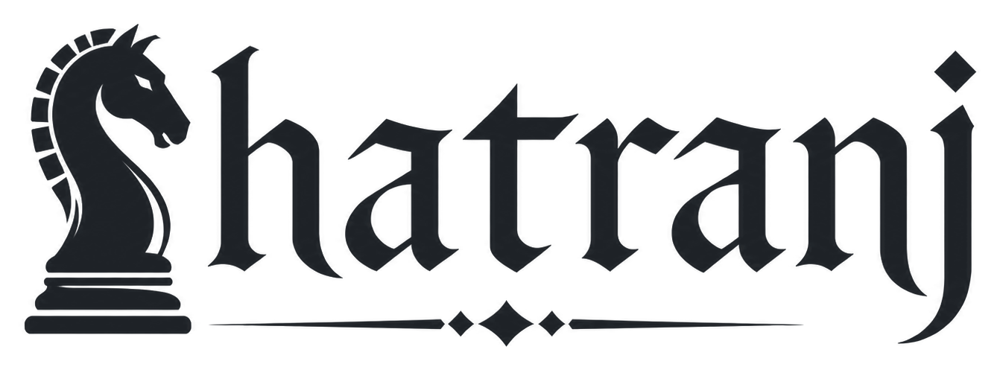
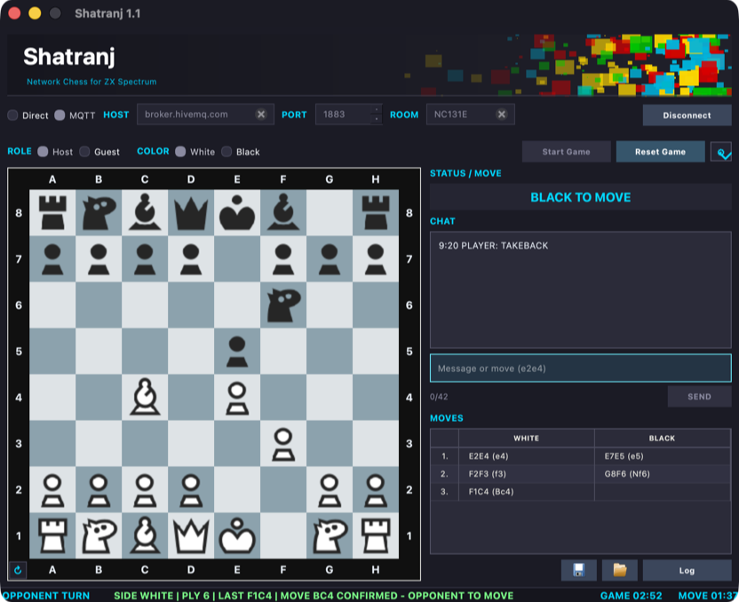
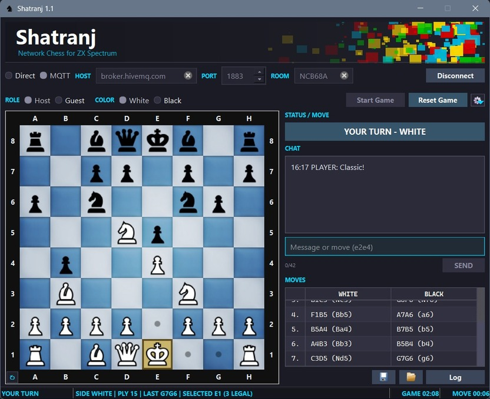
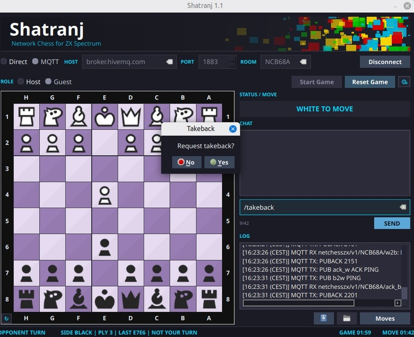
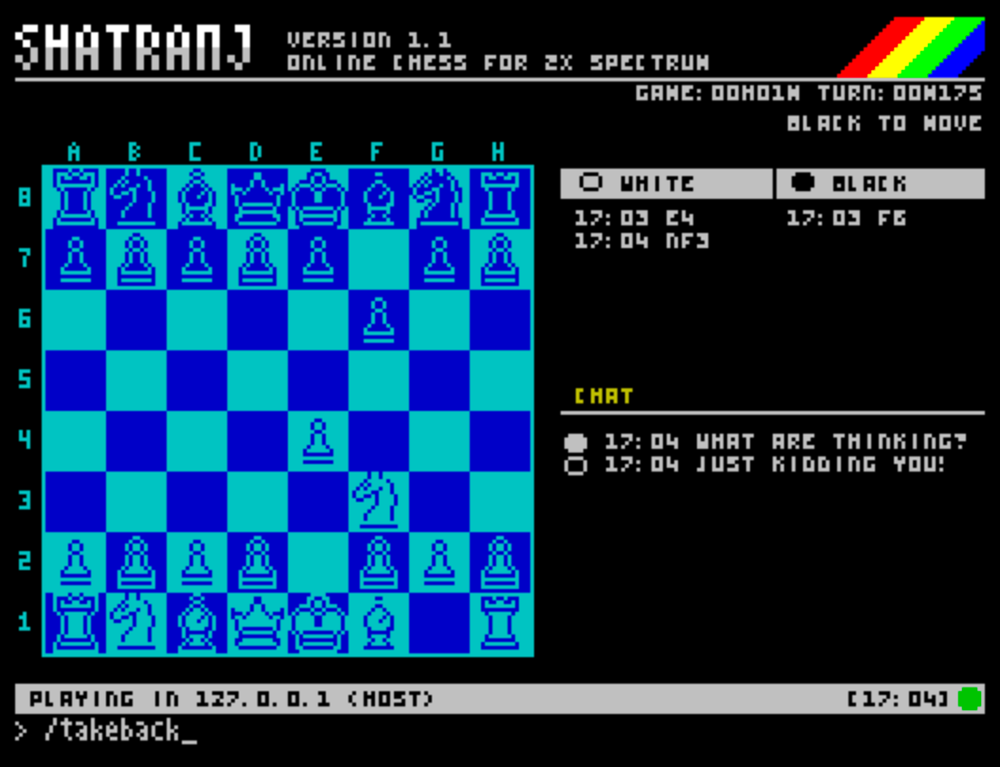
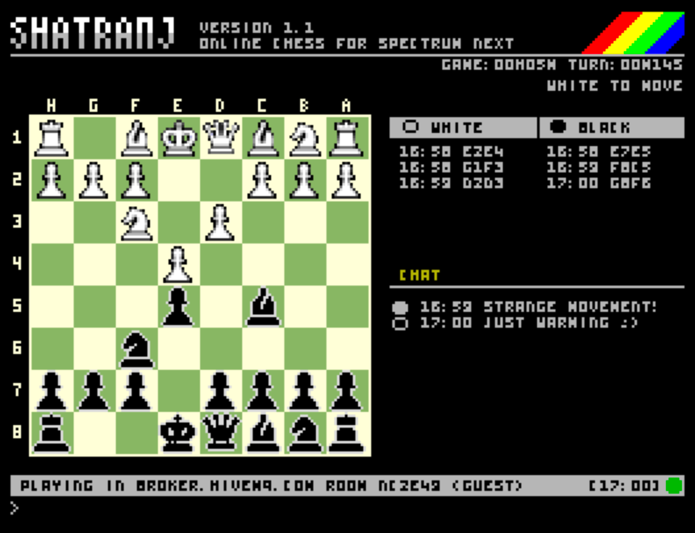
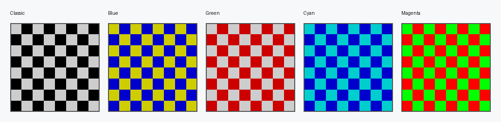
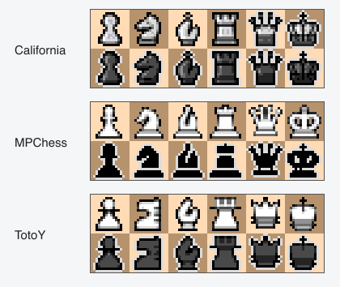

<p align="center">
  <picture>
    <source media="(prefers-color-scheme: dark)" srcset="docs/assets/shatranj-logo-dark.png">
    <source media="(prefers-color-scheme: light)" srcset="docs/assets/shatranj-logo-light.png">
    
  </picture>
</p>

<p align="center">
  <strong>Ajedrez en red desde 48K hasta los escritorios actuales.</strong><br>
  Direct TCP o MQTT · ZX Spectrum clásico y Next · Windows, macOS y Linux
</p>

<p align="center">
  
  
  
  
  
</p>

<p align="center">
  <a href="README.md">English</a> ·
  <a href="https://github.com/IgnacioMonge/Shatranj/releases/latest">Descargar</a> ·
  <a href="docs/README.es.md">Documentación para desarrolladores</a> ·
  <a href="client/README.es.md">Guía del cliente Qt</a>
</p>

---

Shatranj permite jugar al ajedrez en red desde un Spectrum original de 48K, un
Spectrum Next o el cliente Qt para Windows, macOS y Linux. Todos los clientes
utilizan el mismo protocolo y las mismas reglas, de modo que cualquier
plataforma compatible puede jugar contra cualquier otra.

Juega Spectrum contra Spectrum, Spectrum contra escritorio o escritorio contra
escritorio. Usa una conexión directa cuando el invitado pueda alcanzar al
anfitrión, o una sala MQTT cuando la conexión directa no sea práctica. No se
necesitan cuentas ni un servidor central de partidas.

## Por qué Shatranj

|  |  |
| --- | --- |
| **Juego** | Spectrum ↔ Spectrum, Spectrum ↔ escritorio o escritorio ↔ escritorio |
| **Conexión** | Direct TCP sin broker, o MQTT mediante un broker y una sala compartidos |
| **Plataformas** | ZX Spectrum clásico, Spectrum Next, Windows, macOS y Linux |
| **Partida** | Ayudas legales, relojes, historial, chat, tablas, abandono, deshacer jugadas y partidas guardadas |
| **Partidas coherentes** | Las mismas reglas, protocolo, partidas guardadas y comportamiento de sesión en todos los clientes |
| **Versiones retro nativas** | TAP + OVL + DAT para Classic; un NEX autocontenido para Next |

## Índice

- [Plataformas y protocolos](#plataformas-y-protocolos)
- [Descarga](#descarga)
- [Inicio rápido](#inicio-rápido)
- [Galería](#galería)
- [Juegos de piezas y temas de tablero](#juegos-de-piezas-y-temas-de-tablero)
- [Uso de Shatranj](#uso-de-shatranj)
- [Compilar desde el código fuente](#compilar-desde-el-código-fuente)
- [Documentación para desarrolladores](#documentación-para-desarrolladores)
- [Créditos y licencia](#créditos-y-licencia)

## Plataformas y protocolos

| Cliente | Plataformas | Modos de red | Distribución |
| --- | --- | --- | --- |
| Escritorio Qt | Windows, macOS, Linux | Direct TCP, MQTT | Paquete o ejecutable de la plataforma |
| ZX Spectrum clásico | ZX Spectrum de 48K | Direct TCP, MQTT | `SHATRANJ.tap` + `SHATRANJ.OVL` + `SHATRANJ.DAT` |
| Spectrum Next | ZX Spectrum Next | Direct TCP, MQTT | `SHATRANJ.nex` |

Direct TCP es una conexión entre pares: el invitado debe poder alcanzar la
dirección y el puerto del anfitrión. MQTT evita exigir una conexión entrante
directa; ambos clientes se conectan en su lugar al mismo broker y sala.

### Hardware Spectrum

El juego en red desde Spectrum utiliza un enlace UART-ESP compatible con
firmware ESP-AT 1.7.6. El cliente clásico también necesita divMMC/esxDOS para
cargar sus ficheros OVL y DAT. La versión de Next es autocontenida, por lo que
solo hay que copiar el fichero NEX.

## Descarga

Descarga las versiones listas para usar desde la
[última publicación](https://github.com/IgnacioMonge/Shatranj/releases/latest).
Elige el paquete de escritorio para tu sistema operativo, el conjunto de tres
ficheros para Classic o el NEX autocontenido para Next.

## Inicio rápido

1. Inicia Shatranj en ambos clientes.
2. Elige **Host** en un cliente y **Guest** en el otro.
3. Selecciona **Direct** o **MQTT** en ambos lados.
4. En Direct, introduce en el invitado la dirección y el puerto del anfitrión.
   En MQTT, introduce el mismo broker, puerto y sala en ambos clientes.
5. El anfitrión elige el color y comienza la partida. El invitado espera el
   establecimiento de la conexión y juega cuando el indicador de turno lo
   permite.
6. Usa el panel de chat o la entrada de texto del Spectrum para comunicarte
   durante la partida.

### Direct TCP

El anfitrión escucha en el puerto TCP configurado. Comparte su dirección y
puerto con el invitado y comprueba que el firewall y el enrutamiento permiten
la conexión. Direct no utiliza un broker MQTT.

### MQTT

Ambos clientes se conectan al mismo broker y sala. MQTT resulta útil cuando una
conexión directa entre pares no es conveniente, siempre que ambos clientes
puedan acceder al broker.

## Galería

### Escritorio

| macOS — partida MQTT | Windows — partida MQTT | Linux — deshacer jugada |
| --- | --- | --- |
|  |  |  |

### Spectrum

| ZX Spectrum clásico — Direct | Spectrum Next — MQTT |
| --- | --- |
|  |  |

## Juegos de piezas y temas de tablero

El tema y las piezas se eligen durante la configuración de la partida en
Spectrum.

### ZX Spectrum clásico

El cliente clásico incluye tres juegos de piezas de 16×16 — **BRRY**, **SPCY** y
**PIXL** — y cinco paletas: **Classic**, **Blue**, **Green**, **Cyan** y
**Magenta**.

<table>
  <tr>
    <th>Juegos de piezas</th>
    <th>Temas de tablero</th>
  </tr>
  <tr>
    <td align="center" width="34%"></td>
    <td align="center" width="66%"></td>
  </tr>
</table>

### ZX Spectrum Next

El cliente Next utiliza sprites por hardware de 16×16 con tres juegos de piezas
derivados de Lichess — **California**, **MPChess** y **TotoY** — y cinco temas de
tablero RGB333: **Black & White**, **Blue 3**, **Green**, **Brown** y **Wood**.

<table>
  <tr>
    <th>Juegos de piezas de Next</th>
    <th>Temas de tablero de Next</th>
  </tr>
  <tr>
    <td align="center" width="36%"></td>
    <td align="center" width="64%"></td>
  </tr>
</table>

## Uso de Shatranj

El anfitrión controla el inicio y el reinicio; el invitado se incorpora a la
sesión en curso. Solo se aceptan movimientos del bando cuyo turno aparece en
pantalla.

### Controles de escritorio

| Acción | Control |
| --- | --- |
| Configurar una sesión | Elige Direct o MQTT, Host o Guest e introduce la dirección/puerto o el broker/sala |
| Mover una pieza | Haz clic en la casilla de origen y después en la de destino |
| Enviar texto o una jugada | Escribe en la línea de chat/entrada y pulsa Enter |
| Guardar o restaurar | Usa los botones o `/save [nombre]` y `/load [nombre]` |
| Inspeccionar el tráfico | Abre **Log** para ver los mensajes legibles RX/TX |
| Cambiar la apariencia | Abre **Settings** para tablero, piezas, notación y ayudas |

El cliente recuerda la configuración y las direcciones Direct válidas usadas
recientemente. También muestra los relojes de partida, turno y jugada.

### Controles de Spectrum

| Contexto | Control |
| --- | --- |
| Setup: cambiar de fila | Cursor arriba/abajo o `Q`/`A` |
| Setup: cambiar una opción | Cursor izquierda/derecha o `O`/`P` |
| Setup: editar o confirmar | Espacio o Enter |
| Tablero: mover el cursor | Cursores (`5`/`6`/`7`/`8`) o `Q`/`A`/`O`/`P` |
| Tablero: seleccionar origen/destino | Espacio |
| Abrir y enviar la entrada de texto | Enter |
| Abrir el menú de partida | **EDIT** (`Caps Shift` + `1` en el teclado clásico) |
| Menú FILE | `Q`/`A` elige slot; Enter/Espacio carga o guarda; `E` borra |

El menú de partida contiene **FILE**, **DISCONNECT**, **RESET**, **FLIP**,
**THEME** y **ABOUT**. Dentro del menú, usa izquierda/derecha u `O`/`P` y
después Espacio/Enter.

### Comandos de texto

| Entrada | Resultado | Disponibilidad |
| --- | --- | --- |
| `e2e4` | Enviar una jugada por coordenadas | Qt y Spectrum |
| `/draw` | Ofrecer tablas | Qt y Spectrum |
| `/resign` | Abandonar la partida | Qt y Spectrum |
| `/takeback` | Solicitar deshacer la última jugada | Qt y Spectrum |
| `/save [nombre]` | Guardar localmente la posición | Qt; usa FILE en Spectrum |
| `/load [nombre]` | Solicitar restaurar una posición guardada | Anfitrión Qt; usa FILE como anfitrión en Spectrum |

Cualquier otro texto se envía como chat. Qt solicita `q`, `r`, `b` o `n` al
promocionar; los clientes Spectrum promocionan automáticamente a dama.

## Compilar desde el código fuente

El punto de entrada soportado es el Makefile del repositorio:

```sh
make tap              # TAP + OVL + DAT del Spectrum clásico
make nex              # NEX autocontenido para Spectrum Next
make client-test      # compilación y pruebas de Qt
make client           # empaquetado de Qt para distribución
make test             # pruebas compartidas y de Spectrum en host
```

`make tap` escribe los ficheros Classic en `release/`; mantén juntos su TAP,
OVL y DAT. `make nex` escribe la imagen autocontenida de Next en
`release/Next/SHATRANJ.nex`. Las compilaciones Spectrum configuradas aceptan:

```sh
PORT=5000 MQTT_HOST=broker.example MQTT_PORT=1883 MQTT_CODE=ABC123 make tap
```

Consulta [`client/README.es.md`](client/README.es.md) para los requisitos, el
ciclo de desarrollo Qt y el empaquetado de cada plataforma. El procedimiento
completo de validación y publicación se encuentra en
[`docs/maintenance.md`](docs/maintenance.md).

## Documentación para desarrolladores

### Capas

```text
entrada del usuario
  -> FSM de Spectrum o controlador Qt
  -> política de sesión Direct/MQTT
  -> gramática y reglas de ajedrez compartidas
  -> transporte ESP-UART o TCP/MQTT de Qt
  -> validación, ACK/NACK y actualización del tablero
  -> respuesta de la interfaz
```

El código C portable compartido contiene el ajedrez, la construcción y el
análisis del protocolo, la gramática MQTT, los reductores de sesión y el
formato de guardado. Los clientes Spectrum mantienen máquinas de estados
compactas; la aplicación Qt adapta los mismos contratos a la red, la
persistencia y la interfaz Widgets. Las pruebas de transcripción comprueban
todas las implementaciones frente al mismo comportamiento independiente de la
plataforma.

### Mapa del repositorio

| Ruta | Responsabilidad |
| --- | --- |
| `src/common/` | Ajedrez, protocolo, MQTT, sesión y guardado compartidos |
| `src/spectrum/` | Aplicación Classic/Next, tablero, configuración, sesión, transporte, interfaz y overlays |
| `asm/` | Renderizado Z80, UART, esxDOS, overlays y runtime de bajo nivel |
| `src/pc/`, `client/` | Núcleo de escritorio, cliente Qt, configuración de compilación y empaquetado |
| `assets/` | Fuentes, sprites, piezas y demás recursos originales |
| `tests/` | Pruebas de host, transcripción, capas, ABI, tamaños y escritorio |
| `tools/` | Generadores, comprobaciones, empaquetado e informes de tamaño |

### Documentos canónicos

- [`docs/README.es.md`](docs/README.es.md): índice y orden de lectura.
- [`docs/wire-contract.md`](docs/wire-contract.md): contrato normativo Direct/MQTT.
- [`docs/session-core-contract.md`](docs/session-core-contract.md): semántica y transiciones compartidas.
- [`docs/source-layout.md`](docs/source-layout.md): responsabilidad del código fuente y límites entre capas.
- [`docs/architecture-decisions.md`](docs/architecture-decisions.md): decisiones arquitectónicas duraderas.
- [`docs/maintenance.md`](docs/maintenance.md): validación, publicaciones y pruebas con hardware.
- [`docs/zesarux-zxespemu.md`](docs/zesarux-zxespemu.md): integración local de software para Classic y Next.

Los contratos de red y sesión son la autoridad; este README no duplica toda su
gramática. Una pérdida de enlace termina la sesión activa y una conexión
posterior comienza un saludo nuevo.

## Créditos y licencia

- **Piezas BRRY:** basadas en [Chess Pieces 16×16 One-bit](https://berryarray.itch.io/chess-pieces-16x16-one-bit) de [BerryArray](https://berryarray.itch.io).
- **Piezas SPCY:** basadas en [Chess Pieces](https://spicygame.itch.io/chess-pieces) de [Spicy Game](https://spicygame.itch.io).
- **Piezas PIXL:** basadas en [Pixel Art Chess Pieces](https://benrosen.github.io/posts/pixel-art-chess-pieces/) de [Ben Rosen](https://benrosen.github.io).
- **Fuente Ikkle:** [Ikkle 4](https://www.dafont.com/es/ikkle-4.font) de Brixdee, base del texto compacto de Spectrum.
- **mcu-max:** motor de ajedrez para sistemas de pocos recursos, con licencia MIT, de [Gissio](https://github.com/Gissio), incluido con su licencia original.
- El código y el arte de terceros conservan sus licencias y avisos originales.

Shatranj es software libre publicado bajo la
[GNU General Public License v2.0](https://www.gnu.org/licenses/old-licenses/gpl-2.0.html).

## Autor

**M. Ignacio Monge Garcia — 2026**

Las incidencias y contribuciones son bienvenidas en el
[repositorio oficial](https://github.com/IgnacioMonge/Shatranj).

<p align="center"><sub>Conectando el ZX Spectrum al ajedrez en línea desde 2026.</sub></p>
